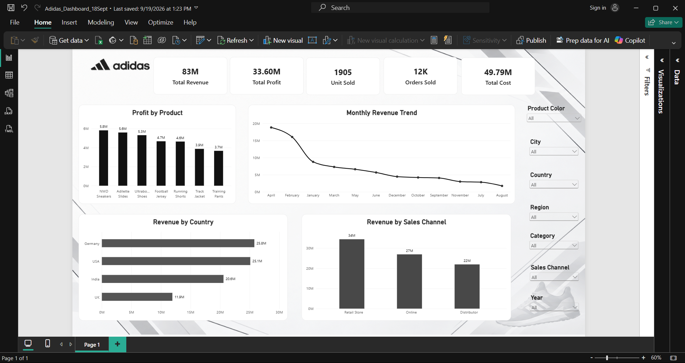

# 👟 Adidas Sales Dashboard – Power BI

### Interactive Sales Analytics Dashboard | Power BI Portfolio Project



---

## 📊 Project Overview

This project is my **First Power BI Dashboard**, created to practice the complete process of turning a raw sales dataset into an interactive business intelligence dashboard.

The project started with a raw Adidas sales dataset, which was first reviewed and cleaned using **Power Query in Power BI**. After preparing the data, it was loaded into Power BI and transformed into an interactive dashboard for analyzing sales performance.

The dashboard focuses on:

- Revenue performance
- Profit performance
- Product performance
- Country-wise sales
- Sales channel performance
- Monthly revenue trends
- Units sold
- Order volume
- Overall cost

The main objective was to understand how raw transactional data can be transformed into a clear and decision-ready visual report.

---

## 🎯 Business Problem

Raw sales data can contain a large number of records and different types of information, making it difficult to quickly understand overall business performance.

This dashboard attempts to solve that problem by bringing important sales metrics and dimensions into a single interactive report.

Instead of manually reviewing rows of data, users can use the dashboard to quickly explore:

- How much revenue is being generated?
- How much profit is being generated?
- Which products contribute the most profit?
- How does revenue change over time?
- Which countries generate the most revenue?
- Which sales channels contribute the most revenue?
- How many units and orders are being generated?
- How does the analysis change when different filters are applied?

---

## 🧹 Data Preparation & Cleaning

Before creating the dashboard, the dataset was reviewed and cleaned using **Power Query in Power BI**.

One of the challenges identified during data preparation was inconsistent formatting in the `Size` field.

For example, some records represented sizes using values such as:

```text
L
M
S
```

while other records used numeric values such as:

```text
42
43
44
```

This created a data consistency issue because different sizing representations were present in the same field.

The data was therefore reviewed and standardized based on how the field would be used for analysis.

### Other data preparation steps included:

- Reviewing the structure of the dataset
- Identifying inconsistent values
- Cleaning and transforming columns
- Checking data types
- Standardizing fields where required
- Preparing the dataset for visualization
- Loading the cleaned data into Power BI
- Validating the data before building visuals

The cleaning stage was an important part of the project because the quality and consistency of the source data directly affects the reliability of the dashboard.

---

## 🔄 Data Analysis Workflow

The overall workflow followed in this project was:

```text
Raw Dataset
     ↓
Data Review
     ↓
Power Query
     ↓
Data Cleaning
     ↓
Data Transformation
     ↓
Data Loading
     ↓
Power BI Analysis
     ↓
Visualisation
     ↓
Interactive Dashboard
     ↓
Business Insights
```

This helped me understand the complete workflow of a basic Power BI analytics project rather than focusing only on dashboard design.

---

## 📌 Key Performance Indicators

The dashboard currently provides the following high-level KPIs:

| KPI | Value |
|---|---:|
| Total Revenue | 83M |
| Total Profit | 33.60M |
| Units Sold | 1,905 |
| Orders Sold | 12K |
| Total Cost | 49.79M |

> KPI values can change depending on the filters applied in the dashboard.

---

## 📈 Dashboard Features

The dashboard includes several visualizations designed to provide different perspectives of the sales data.

### 1. Profit by Product

A column chart showing profit generated by different products.

This helps identify which products contribute more to overall profit.

### 2. Monthly Revenue Trend

A line chart showing revenue across different months.

This helps analyze changes in revenue over time and identify periods with relatively higher or lower revenue.

### 3. Revenue by Country

A horizontal bar chart comparing revenue generated across different countries.

This provides a geographic view of sales performance.

### 4. Revenue by Sales Channel

A column chart comparing revenue across:

- Retail Store
- Online
- Distributor

This helps understand how different sales channels contribute to overall revenue.

### 5. Interactive Filters

The dashboard includes filters for dimensions such as:

- Product Color
- City
- Country
- Region
- Category
- Sales Channel
- Year

These filters allow users to explore specific segments of the dataset without manually changing the underlying data.

---

## 🔍 What Can Be Analysed From This Dataset?

The dataset provides several opportunities for business analysis.

### Product Analysis

The data can be used to identify:

- High-profit products
- Low-profit products
- Product categories contributing to revenue
- Product-level sales performance
- Products that may require further investigation

### Geographic Analysis

The dashboard can help compare:

- Country-wise revenue
- City-level performance
- Regional performance
- Geographic concentration of sales

### Sales Channel Analysis

Revenue can be compared across:

- Retail stores
- Online sales
- Distributors

This can help understand how sales are distributed across different channels.

### Time-Based Analysis

The data can also be used to investigate:

- Monthly revenue trends
- Seasonal patterns
- High-performing months
- Low-performing months
- Changes in sales performance over time

### Customer & Product Segmentation

With additional analysis, the dataset could also be explored by:

- Customer characteristics
- Product categories
- Product colors
- Locations
- Sales channels
- Order behaviour

---

## 💡 What I Learned From This Project

As my **first Power BI project**, this project helped me understand that creating a dashboard is not only about selecting charts and making them look good.

I learned the importance of the complete data analytics workflow.

### 1. Data Cleaning Matters

A dashboard is only as useful as the data behind it.

The inconsistent `Size` values helped me understand how real-world datasets can contain fields that require cleaning and standardization before analysis.

### 2. Power Query Is an Important Part of Power BI

I learned how Power Query can be used to:

- Inspect data
- Clean columns
- Transform values
- Fix inconsistencies
- Prepare data before visualization

### 3. Visual Selection Matters

Different questions require different visualizations.

For example:

- Bar charts are useful for comparisons
- Line charts are useful for trends
- KPI cards are useful for high-level metrics
- Filters help users explore specific segments

### 4. Dashboard Layout Matters

During development, I faced normal dashboard design challenges such as:

- Deciding which visuals were necessary
- Arranging multiple visuals on one page
- Maintaining readability
- Choosing appropriate chart sizes
- Managing labels and values
- Making filters easy to use
- Keeping the dashboard visually balanced

These challenges helped me understand that dashboard development involves both analytical thinking and visual communication.

### 5. Business Questions Should Come Before Visuals

Instead of simply adding charts to a dashboard, I learned to think about:

> "What question is this visual answering?"

This changed the way I approached the dashboard design.

---

## 📚 How Useful Is This Dataset?

This dataset was useful for learning and practicing the Power BI workflow.

However, it is important to clarify that the dataset should **not be treated as official Adidas business data or real company performance data**.

The dataset is used as a learning and portfolio dataset.

Its main value in this project was providing enough dimensions and measures to practice:

- Data cleaning
- Data transformation
- Data analysis
- KPI creation
- Data visualization
- Dashboard design
- Interactive filtering
- Business-oriented reporting

Therefore, the purpose of this project is not to represent actual Adidas sales performance, but to demonstrate the process of working with sales data and building a Power BI solution.

---

## ⚠️ Dataset Limitations

Because this is a practice/portfolio dataset, the analysis has several limitations.

### Data Authenticity

The dataset does not represent verified Adidas business data.

### Limited Business Context

The dataset does not provide complete information about actual:

- Marketing expenditure
- Inventory
- Customer acquisition cost
- Returns reasons
- Supplier costs
- Store-level operating costs
- Competitor performance

### Limited Customer Information

More detailed customer-level information could allow deeper analysis of:

- Customer retention
- Customer lifetime value
- Repeat purchase behaviour
- Customer segmentation

Therefore, the dashboard should be viewed as an **analytical practice project rather than a real-world business reporting system**.

---

## 🚀 Potential Future Analysis

The existing dataset and dashboard could be extended to answer additional business questions.

Possible improvements include:

- Profit margin analysis
- Year-over-year revenue growth
- Month-over-month growth
- Average order value
- Sales quantity trends
- Product profitability
- Regional profitability
- Channel profitability
- Customer segmentation
- Customer retention analysis
- Return and cancellation analysis
- Seasonal sales analysis
- Top and bottom performing products
- Contribution percentage by country
- Contribution percentage by sales channel

Additional DAX measures and calculated metrics could also be introduced to make the dashboard more analytical.

---

## 🛠️ Tools & Technologies

### Tools

- Microsoft Power BI
- Power Query
- DAX
- Git
- GitHub

### Skills Practiced

- Data Cleaning
- Data Transformation
- Data Analysis
- Data Visualization
- KPI Design
- Power Query
- DAX
- Dashboard Design
- Interactive Filtering
- Business Intelligence
- Git & GitHub

---

## 📊 Dashboard Preview

The dashboard provides a single-page overview of Adidas sales performance.

It combines KPI cards, product analysis, revenue trends, geographic analysis and sales channel analysis into an interactive Power BI report.

---

## 📂 Project Files

| File | Description |
|---|---|
| `Adidas_Dashboard_19Sept.pbix` | Power BI dashboard file |
| `Adidas_Dataset.csv` | Source dataset used for the project |
| `Dashboard.png` | Dashboard preview image |

---

## 🎓 Project Type

**Data Analytics / Business Intelligence Portfolio Project**

This is my first Power BI project, created to build practical experience with data cleaning, transformation, analysis and interactive dashboard development.

---

## 👤 Author

**Devansh Gupta**

Data Analytics Portfolio Project

---

⭐ If you find this project useful, feel free to explore the dashboard and dataset.
